# Navdy HUD — 콤마 주행 정보 표시

Navdy HUD 에서 직접 도는 안드로이드 앱. 콤마(openpilot)가 블루투스로 보내는
주행 텔레메트리를 받아 차선·앞차·과속카메라·사각지대를 HUD 에 그린다.

폰을 거치지 않는다. Navdy 가 루팅된 안드로이드라 우리 앱을 올릴 수 있어서,
콤마 → 블루투스 → Navdy 로 바로 간다.

## 기기

ADB 로 직접 확인한 값이다.

```
product   navdy_hud_6dl       Android 5.1.1 (API 22)
SoC       Freescale i.MX6 armv7l,  커널 3.14
패널      640 x 480  60Hz  32bpp   (네이티브, 스케일링 없음)
density   160 dpi
RAM       1GB            /data 여유 약 350MB
root      완전 루팅 (adbd as root, /sbin/su)
```

콤바이너 HUD 라 **검은색은 투사되지 않는다**. 배경은 항상 검게 두고 밝은
요소만 그린다. 회색 계열은 주간에 거의 사라지므로 쓰지 않는다.

**상하 1/6 은 실제로 투사되지 않는다.** 그 밖으로 그린 것은 운전자에게 닿지
않으므로 도로도 글자도 안쪽에만 배치한다(`Projection.SAFE_MARGIN`).

### USB 모드

Navdy 는 ADB 와 대용량저장을 배타적으로 내보낸다.

| 모드 | PID | 조건 |
|---|---|---|
| ADB | `VID_9886&PID_0001` | **부팅이 끝난 뒤** USB 를 꽂는다 |
| 대용량저장 | `VID_9886&PID_0003` | 부팅 중에 꽂혀 있으면 이쪽으로 고착 |

ADB 가 안 잡히면 USB 를 뽑고, HUD 화면이 평소대로 올라온 뒤 다시 꽂는다.
12V 전원은 항상 필요하다. PC USB 만으로는 부팅되지 않는다(저장소가
`No Media` 로 뜬다).

## 통신

콤마가 클라이언트, 이 앱이 RFCOMM 서버다.

```
서비스   CommaHUD
UUID     b8949674-c91b-4c36-a9d0-c24c644826a0
프레임   [타입 2B][길이 4B][내용]   빅엔디안
           1  텔레메트리 JSON
           2  PING
```

콤마 쪽 구현은 `openpilot/selfdrive/eon_cluster/bt_link.py` (geniuth/openpilot
carrot-wip). UUID 가 양쪽에서 같아야 한다.

패킷은 약 1.6KB, 10Hz 로 약 126kbps. 원본 텔레메트리(5.7KB)에서 HUD 가 그리는
19개 항목만 남기고 폴리라인을 13점으로 솎은 것이다.

### 좌표계

콤마가 보내는 값은 차량 기준이다. `x` 는 전방 거리(m), `y` 는 횡방향(m)이고
**음수가 왼쪽**이다. 실측으로 확인했다:

```
lanes[0] y=-4.89 (바깥좌)   lanes[1] y=-1.73 (좌)
lanes[2] y=+1.74 (우)       lanes[3] y=+4.51 (바깥우)
```

차선 슬롯은 0=바깥좌, 1/2=자차선, 3=바깥우로 고정이고 각 슬롯에 신뢰도 `c` 가
붙는다. 정차·저속에서는 `c` 가 0 으로 떨어져 차선이 안 그려지는데 버그가
아니다. 모델이 실제로 차선을 확신하지 못하는 상태다.

### 차선 종류

`laneL` / `laneR` 은 카메라가 읽은 실제 노면 표시다. 모델 차선(`lanes`)에는
없는 정보라 여기서만 점선/실선과 색을 알 수 있다. VW MEB 는 `MEB_Camera_01`
에서 읽어 채운다.

```
값 = 색*10 + 종류
  종류  0 점선 / 1 실선 / 2 미상
  색    +10 흰 / +20 노랑 / +30 파랑      예) 21 = 실선 노란색
  -1    지원하지 않는 차
```

바깥 차선(슬롯 0, 3)은 종류 정보가 없어 실선으로 그린다. 없는 노면 표시를
지어내지 않기 위해서다.

### 사각지대

별도 기호 없이 **차선 자체를 물들인다**. 시선이 도로에서 떨어지지 않는다.

| 상황 | 그 쪽 차선 |
|---|---|
| 사각지대 비었음 | 흰색(평소) |
| 차 있음, 깜빡이 off | 노랑 |
| 차 있음, 그 방향 깜빡이 on | 빨강 |

## 빌드

Gradle 을 쓰지 않는다. Android SDK 도구만으로 빌드한다.

```powershell
.\build.ps1
```

필요한 것: JDK 17, Android SDK (build-tools 36.0.0, platforms/android-34).

`javac` 에 **`-encoding UTF-8` 이 반드시 있어야 한다**. 윈도 기본 코드페이지
(949)로 읽으면 한글 주석에서 컴파일이 깨진다. 그리고 네이티브 도구가 안내문을
stderr 로 내보내므로 실패 판정은 종료코드로만 한다.

## 실행

```powershell
adb install -r build\CommaHUD.apk
adb shell am start -n kr.geniu.navdyhud/.HudActivity                  # 콤마 연결
adb shell am start -n kr.geniu.navdyhud/.HudActivity --ez demo true   # 데모
```

순정 Navdy 화면으로 돌아가려면:

```powershell
adb shell am start -n com.navdy.hud.app/.ui.activity.MainActivity
```

### 데모 모드

콤마 없이 모든 화면 상태를 40초에 순회한다. 사각지대 빨간 표시는 깜빡이를 켠
채 옆 차선에 차가 있어야 하고 과속카메라는 단속 구간에 들어가야 뜨는데, 그런
상태를 실차에서 우연히 만나길 기다리면 디자인 작업이 몇 주 늘어진다.

콤마가 보내는 것과 **같은 모양의 패킷**을 만들어 같은 렌더 경로로 넣는다.
데모 전용 그리기를 따로 두면 여기서 예쁜 것이 실차에서 다르게 나온다.

| # | 장면 | 확인 대상 |
|---|---|---|
| 1 | 정속 + 앞차 접근 | 차선·경로·앞차 크기 변화 |
| 2 | 앞차 급감속 | 후미등 빨강 |
| 3 | 좌측 깜빡이 + 사각지대 빔 | 노란 화살표 |
| 4 | 좌측 깜빡이 + 사각지대 점유 | 빨간 화살표 + "차량" |
| 5 | 과속카메라 200→40m | 원형 표지 + 거리 |
| 6 | 구간단속 | "구간" 접두 |
| 7 | 방지턱 + 우측 사각지대 | 방지턱 표시, 좌우 대칭 |
| 8 | 송신 중단 | 낡은 데이터 차단 |

## 구성

| 파일 | 역할 |
|---|---|
| `CommaLink.java` | RFCOMM 서버. 리스너를 계속 열어둬 SDP 레코드를 유지한다 |
| `Projection.java` | 월드(m) → 화면(px). `u = cx + f·y/x`, `v = 지평선 + f·camH/x` |
| `HudView.java` | 렌더링 전부 |
| `DemoSource.java` | 합성 데이터 |
| `HudActivity.java` | 진입점. `--ez demo true` 로 데모 선택 |

### 투영 상수

`Projection.java` 의 값은 실기기 화면을 보며 맞춘 것이다.

```
CAM_H   2.2m    가상 카메라 높이. 화면 구도를 정하는 값이지 실제 높이가 아니다
MAX_X   50m     더 멀리 그리면 지평선에 뭉쳐 근거리가 눌린다
MIN_X   2.0m    더 가까우면 u 가 발산해 화면 밖으로 나간다
지평선  0.30h
초점    0.625w
```

1.2m / 90m 로 뒀을 때는 3~90m 가 화면 y=168~323 에만 몰려 아래 30% 가 비고
도로가 공중에 뜬 것처럼 보였다.

## 화면

실기기(640x480) 캡처다. 콤바이너 HUD 라 검은 부분은 투사되지 않으므로 실제로는
밝은 요소만 유리에 뜬다. 상하 1/6 이 비어 있는 것은 그 영역이 투사되지 않기
때문이다.

| 정속 주행 | 앞차 급감속 |
|---|---|
| 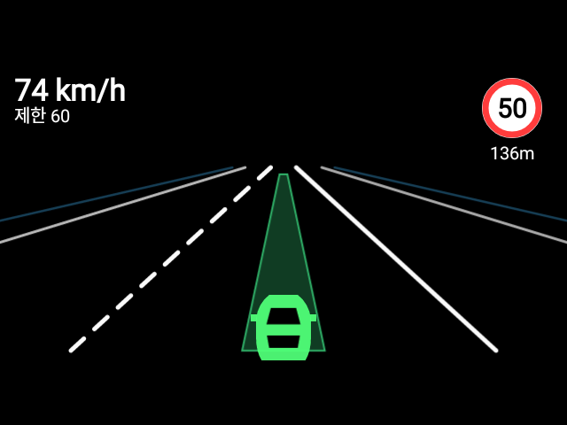 | 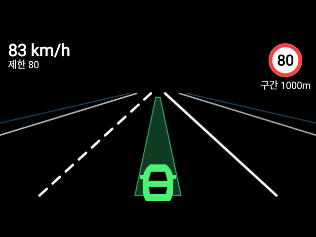 |
| 좌측 점선 / 우측 실선, 경로 띠, 과속카메라 표지 | 앞차가 감속하면 붉게 |

사각지대는 별도 기호 없이 그 쪽 차선을 물들인다.

| 깜빡이 off — 노랑 | 그 방향 깜빡이 on — 빨강 |
|---|---|
| 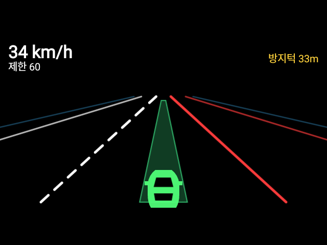 | 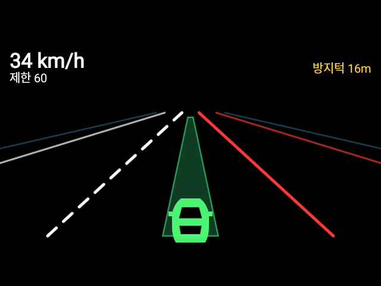 |
| 옆에 차가 있다 | 지금 들어가면 위험하다 |

| 구간단속 | 신호 끊김 |
|---|---|
| 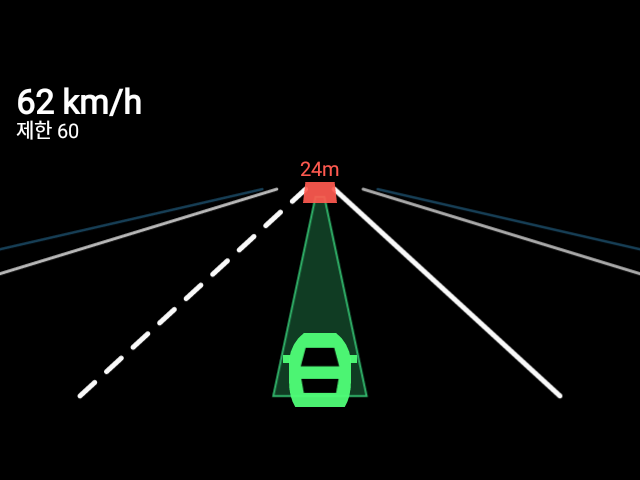 | 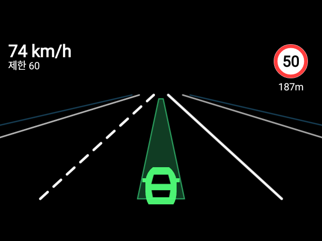 |
| 제한속도와 남은 거리 | 낡은 정보를 실시간으로 착각하지 않도록 전부 감춘다 |

### 디자인 변경 과정

이전 캡처는 `docs/captures-old/` 에 남겼다. 주요 변경은 세 단계였다.

**투영** — 가상 카메라 1.2m / 90m 까지 그리던 때는 거리 대부분이 상단에
압축돼 별 모양이 되고 아래 30% 가 비었다.

| 이전 | 이후 |
|---|---|
| 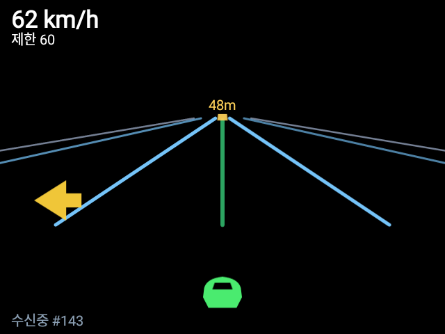 | 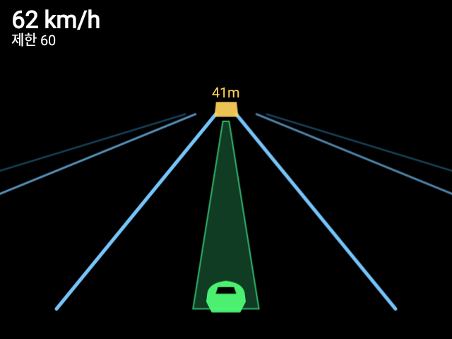 |

**경로** — 선 한 줄은 굵기가 일정해 수직 막대처럼 보인다. 거리별 폭을 투영한
띠로 바꿨다.

| 이전 | 이후 |
|---|---|
| 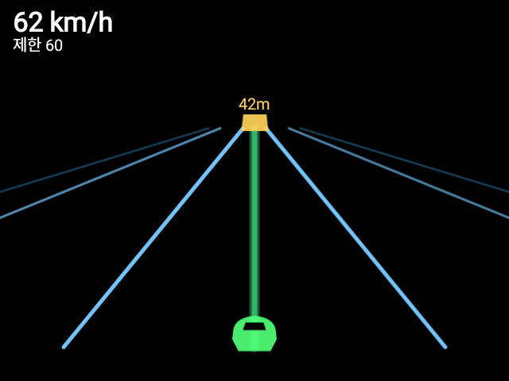 | 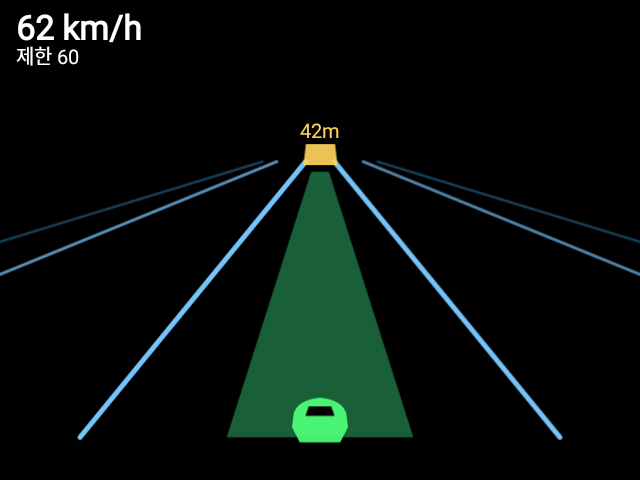 |

**차선과 사각지대** — 파란 차선을 흰색으로 바꾸고 점선/실선을 구분했다.
사각지대는 화살표에서 차선 색으로 옮겼다.

| 이전 (파란 차선 + 화살표) | 이후 (흰 차선, 차선이 물든다) |
|---|---|
| 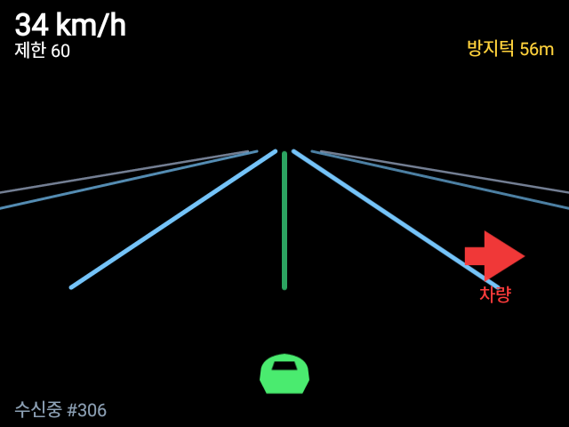 |  |

## 남은 일

- 실차 주행 사진(주간/야간)을 보고 색·굵기 확정. 화면 캡처는 프레임버퍼
  이미지라 실제 투사 밝기·대비를 알려주지 못한다
- 안전영역 확인. `dumpsys display` 에 `real 640x480 / app 598x480` 로 나와
  앱 영역이 42px 좁게 보고되는데, 실제로는 전체를 받는 것으로 보인다
- 과속카메라 표지와 사각지대 표시는 아직 실주행에서 뜨는 것을 못 봤다
